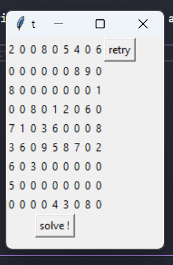
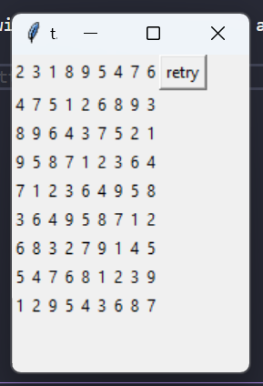

# sudoku_solver

- add requirements package using this code:
```bash
pip install -r requirements.txt
```

-now you can run the main.py file:
```bash
py main.py
```

  + this will automatically generate a new sudoku problem for you or you can click "retry" and a new sudoku problem will be generate.
  + clicking the "solve!" button will give you one of the answer for your problem



